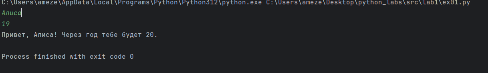

# Лабораторна работа №1

Задача 1
```py
name = input()
age = int(input())
print(f'Привет, {name}! Через год тебе будет {age + 1}.')
```


Задача 2
```py
import math
a1 = input()
a2 = input()
a1 = a1.replace(',', '.')
a2 = a2.replace(',', '.')
a1 = float(a1)
a2 = float(a2)
sum = a1 + a2
avg = sum / 2
print(f'sum={sum}; avg={round(avg, 2)}')
```


Задача 3
```py
price = float(input())
discount = float(input())
vat = float(input())
base = price * (1 - discount / 100)
vat_amount = base * (vat / 100)
total = base + vat_amount
print(f'База после скидки: {base:.2f}')
print(f'НДС:               {vat_amount:.2f}')
print(f'Итого к оплате:    {total:.2f}')
```


Задача 4
```py
m = int(input())
ch = m // 60
print(f'{ch}:{m - ch * 60}')
```


Задача 5
```py
fio = input().split()
print(f'Инициалы: {fio[0][0] + fio[1][0] + fio[2][0]}.')
print(f'Длина (символов): {len(fio[0]) + len(fio[1]) + len(fio[2]) + 2}')
```


Задача 6
```py
n = int(input().strip())
t = 0
f = 0
for x in range(n):
    line = input().strip()
    a = line.split()
    b = a[-1]
    if b == 'True':
        t += 1
    elif b == 'False':
        f += 1
print(t, f)
```


Задача 7
```py
a = input().strip()
alf = 'QWERTYUIOPASDFGHJKLZXCVBNM'
ch = '0123456789'
bukv = 'qwertyuiopasdfghjklzxcvbnmQWERTYUIOPASDFGHJKLZXCVBNM'
start = 0
for i in range(len(a)):
    st = a[i]
    if st in alf:
        start = i
        break
second = 0
for i in range(len(a)):
    st = a[i]
    if st in ch and a[i + 1] in bukv:
        second = i + 1
        break
step = second - start
ans = []
i = start
while i < len(a):
    ans.append(a[i])
    if a[i] == '.':
        break
    i += step
print(''.join(ans))
```


# Лабораторная работа №2
Задача 1
```py
def min_max(nums):
    if len(nums) == 0:
        raise ValueError
    minimumchik = min(nums)
    maxichek = max(nums)
    return (minimumchik, maxichek)
```


Задача 2
```py
def unique_sorted(nums):
    otvetik = sorted(set(nums))
    return otvetik
```


Задача 3
```py
def flatten(nums):
    otvetik = []
    for e in nums:
        if type(e) == list or type(e) == tuple:
            for i in range(len(e)):
                if e[i] != '':
                    otvetik.append(e[i])
        else:
            raise TypeError
    return otvetik
```


Задача 4
```py
def transpose(mat):
    new_mat = []
    if len(mat) == 0:
        return []
    kol_simv = len(mat[0])
    for elem in mat:
        if len(elem) != kol_simv:
            raise ValueError
    for stolbik in range(kol_simv):
        new_strochechka = []
        for strochechka in range(len(mat)):
            new_strochechka.append(mat[strochechka][stolbik])
        new_mat.append(new_strochechka)
    return new_mat
```


Задача 5
```py
def row_sums(mat):
    kol_simv = len(mat[0])
    for elem in mat:
        if len(elem) != kol_simv:
            raise ValueError
    otvetik = []
    for elem in mat:
        otvetik.append(sum(elem))
    return otvetik
```


Задача 6
```py
def col_sums(mat):
    kol_simv = len(mat[0])
    for elem in mat:
        if len(elem) != kol_simv:
            raise ValueError
    otvetik = [0] * len(mat[0])
    for strochechka in mat:
        for stolbik in range(len(strochechka)):
            otvetik[stolbik] = otvetik[stolbik] + strochechka[stolbik]
    return otvetik
```


Задача 7
```py
def format_record(tuptup):
    otvetik = ''
    if type(tuptup) != tuple:
        tuptup = tuple(tuptup)
    if len(tuptup) == 3:
        fio = tuptup[0]
        gruppochka = tuptup[1]
        gpa = tuptup[2]
        if type(fio) == str and type(gruppochka) == str and type(gpa) == float and len(fio.split()) >= 2:
            fio = fio.split()
            if len(fio) == 2:
                fam = fio[0].capitalize()
                name = fio[1].capitalize()
                new_fio = f'{fam} {name[0]}.,'
            if len(fio) == 3:
                fam = fio[0].capitalize()
                name = fio[1].capitalize()
                otch = fio[2].capitalize()
                new_fio = f'{fam} {name[0]}.{otch[0]}.,'
            new_gruppochka = f'гр. {gruppochka},'
            otvetik = f'{new_fio} {new_gruppochka} {gpa:.2f}'
            return otvetik
        else:
            raise ValueError
    else:
        raise ValueError

```
