# Лабораторная работа №1

Задача 1
```py
name = input()
age = int(input())
print(f'Привет, {name}! Через год тебе будет {age + 1}.')
```


Задача 2
```py
import math
a1 = input()
a2 = input()
a1 = a1.replace(',', '.')
a2 = a2.replace(',', '.')
a1 = float(a1)
a2 = float(a2)
sum = a1 + a2
avg = sum / 2
print(f'sum={sum}; avg={round(avg, 2)}')
```


Задача 3
```py
price = float(input())
discount = float(input())
vat = float(input())
base = price * (1 - discount / 100)
vat_amount = base * (vat / 100)
total = base + vat_amount
print(f'База после скидки: {base:.2f}')
print(f'НДС:               {vat_amount:.2f}')
print(f'Итого к оплате:    {total:.2f}')
```


Задача 4
```py
m = int(input())
ch = m // 60
print(f'{ch}:{m - ch * 60}')
```


Задача 5
```py
fio = input().split()
print(f'Инициалы: {fio[0][0] + fio[1][0] + fio[2][0]}.')
print(f'Длина (символов): {len(fio[0]) + len(fio[1]) + len(fio[2]) + 2}')
```


Задача 6
```py
n = int(input().strip())
t = 0
f = 0
for x in range(n):
    line = input().strip()
    a = line.split()
    b = a[-1]
    if b == 'True':
        t += 1
    elif b == 'False':
        f += 1
print(t, f)
```


Задача 7
```py
a = input().strip()
alf = 'QWERTYUIOPASDFGHJKLZXCVBNM'
ch = '0123456789'
bukv = 'qwertyuiopasdfghjklzxcvbnmQWERTYUIOPASDFGHJKLZXCVBNM'
start = 0
for i in range(len(a)):
    st = a[i]
    if st in alf:
        start = i
        break
second = 0
for i in range(len(a)):
    st = a[i]
    if st in ch and a[i + 1] in bukv:
        second = i + 1
        break
step = second - start
ans = []
i = start
while i < len(a):
    ans.append(a[i])
    if a[i] == '.':
        break
    i += step
print(''.join(ans))
```


# Лабораторная работа №2
Задача 1
```py
def min_max(nums):
    if len(nums) == 0:
        raise ValueError
    minimumchik = min(nums)
    maxichek = max(nums)
    return (minimumchik, maxichek)
```


Задача 2
```py
def unique_sorted(nums):
    otvetik = sorted(set(nums))
    return otvetik
```


Задача 3
```py
def flatten(nums):
    otvetik = []
    for e in nums:
        if type(e) == list or type(e) == tuple:
            for i in range(len(e)):
                if e[i] != '':
                    otvetik.append(e[i])
        else:
            raise TypeError
    return otvetik
```


Задача 4
```py
def transpose(mat):
    new_mat = []
    if len(mat) == 0:
        return []
    kol_simv = len(mat[0])
    for elem in mat:
        if len(elem) != kol_simv:
            raise ValueError
    for stolbik in range(kol_simv):
        new_strochechka = []
        for strochechka in range(len(mat)):
            new_strochechka.append(mat[strochechka][stolbik])
        new_mat.append(new_strochechka)
    return new_mat
```


Задача 5
```py
def row_sums(mat):
    kol_simv = len(mat[0])
    for elem in mat:
        if len(elem) != kol_simv:
            raise ValueError
    otvetik = []
    for elem in mat:
        otvetik.append(sum(elem))
    return otvetik
```


Задача 6
```py
def col_sums(mat):
    kol_simv = len(mat[0])
    for elem in mat:
        if len(elem) != kol_simv:
            raise ValueError
    otvetik = [0] * len(mat[0])
    for strochechka in mat:
        for stolbik in range(len(strochechka)):
            otvetik[stolbik] = otvetik[stolbik] + strochechka[stolbik]
    return otvetik
```


Задача 7
```py
def format_record(tuptup):
    otvetik = ''
    if type(tuptup) != tuple:
        raise TypeError
    if len(tuptup) == 3:
        fio = tuptup[0]
        gruppochka = tuptup[1]
        gpa = tuptup[2]
        if type(fio) == str and type(gruppochka) == str and type(gpa) == float and len(fio.split()) >= 2:
            fio = fio.split()
            if len(fio) == 2:
                fam = fio[0].capitalize()
                name = fio[1].capitalize()
                new_fio = f'{fam} {name[0]}.,'
            if len(fio) == 3:
                fam = fio[0].capitalize()
                name = fio[1].capitalize()
                otch = fio[2].capitalize()
                new_fio = f'{fam} {name[0]}.{otch[0]}.,'
            new_gruppochka = f'гр. {gruppochka},'
            otvetik = f'{new_fio} {new_gruppochka} {gpa:.2f}'
            return otvetik
        else:
            raise ValueError
    else:
        raise ValueError

```


# Лабораторная работа №3
Задача A
```py
import re

print("Тесты normalize")

def normalize(text, *, casefold = True, yo2e = True):
    text = re.sub(r"[\t\r\n\f\v]", " ", text)
    if yo2e:
        text = text.replace("ё", "е").replace("Ё", "Е")
    if casefold:
        text = text.casefold()
    text = re.sub(r" +", " ", text)
    return text.strip()

tests = ["ПрИвЕт\nМИр\t", "ёжик, Ёлка", "Hello\r\nWorld", "  двойные   пробелы  "]
for array in tests:
    result = normalize(array)
    print(f"{array} - {result}")

print("\n")
print("Тесты tokenize")

def tokenize(text):
    clear_text = re.sub(r'[^\w\s-]', ' ', text)
    new_text = clear_text.split()
    return new_text
tests = ["привет мир", "hello,world!!!", "по-настоящему круто", "2025 год", "emoji 😀 не слово"]
for array in tests:
    result = tokenize(array)
    print(f"{array} - {result}")


def count_freq(tokens):
    freq = {}
    for token in tokens:
        if token in freq:
            freq[token] += 1
        else:
            freq[token] = 1


print("\n")
print("Тесты count_freq и top_n")


def top_n(freq, n = 2):
    sorted_items = sorted(freq.items(), key=lambda x: (-x[1], x[0]))
    return sorted_items[:n]

tests = [["a", "b", "a", "c", "b", "a"], ["bb", "aa", "bb", "aa", "cc"]]

for array in tests:
    result = top_n(count_freq((array)))
    print(f"{array} - {result}")
```


Задача B
```py
import sys
import re

def normalize(text, *, casefold = True, yo2e = True):
    text = re.sub(r"[\t\r\n\f\v]", " ", text)
    if yo2e:
        text = text.replace("ё", "е").replace("Ё", "Е")
    if casefold:
        text = text.casefold()
    text = re.sub(r" +", " ", text)
    return text.strip()

def tokenize(text):
    clear_text = re.sub(r'[^\w\s-]', ' ', text)
    new_text = clear_text.split()
    return new_text

def count_freq(tokens):
    freq = {}
    for token in tokens:
        if token in freq:
            freq[token] += 1
        else:
            freq[token] = 1
    return freq

def top_n(freq, n = 2):
    sorted_items = sorted(freq.items(), key=lambda x: (-x[1], x[0]))
    return sorted_items[:n]

sys.stdin.reconfigure(encoding='utf-8')
a = sys.stdin.read().strip()
norm = normalize(a)
token = tokenize(norm)
print("Всего слов:", len(token))
count = count_freq(token)
print("Уникальных слов:", len(count))
top = top_n(count)
print("Топ-5:")
for element in top:
    print(str(element[0]) + ":" + str(element[1]))
```


# Лабораторная работа №4

Задание А

```py
from pathlib import Path
import csv


# import sys
# sys.path.append(r'C:\Users\ameze\Desktop\python_labs\src')
def read_text(path, encoding='utf-8'):
    path = Path(path)
    with open(path, 'r', encoding=encoding) as f:
        return f.read()


try:
    text = read_text(r'src/data/lab4/input.txt', encoding='utf-8')
    print(text)
except FileNotFoundError:
    print('Файл не найден')
except UnicodeDecodeError:
    print('Неподходящая кодировка')


def write_csv(rows, path, header):
    path = Path(path)
    if rows:
        last_dlina = len(rows[-1])
        for row in rows:
            if len(row) != last_dlina:
                raise ValueError
    with open(path, 'w', newline='', encoding='utf-8') as f:
        csv_maker = csv.writer(f, delimiter=',')
        if header:
            csv_maker.writerow(header)
        for row in rows:
            csv_maker.writerow(row)


write_csv([("word", "count"), ("test", 3)], r'src/data/lab4/check.csv', None)
```


Задание В

```py
from pathlib import Path
import csv
import sys

sys.path.append(r'C:\Users\ameze\Desktop\python_labs\src')

from lib.normalize import normalize
from lib.tokenize import tokenize
from lib.count_freq_top_n_function import count_freq, top_n


def read_text(path, encoding='utf-8'):
    path = Path(path)
    with open(path, 'r', encoding='utf-8') as f:
        return f.read()


def report_writer(path, count_f, encoding='utf-8'):
    path = Path(path)
    sortirovka = top_n(count_f, len(count_f))
    with open(path, 'w', newline='', encoding='utf-8') as f:
        csv_maker = csv.writer(f, delimiter=',')
        csv_maker.writerow(('word', 'count'))
        for word, freq in sortirovka:
            csv_maker.writerow((word, freq))


try:
    text_i = read_text(r'src/data/lab4/input.txt', encoding='utf-8')
    norm = normalize(text_i)
    token = tokenize(norm)
    count_f = count_freq(token)
    top = top_n(count_f, 5)

    report_writer(r'src/data/lab4/report.csv', count_f, encoding='utf-8')
    print('Всего слов:', len(token))
    print('Уникальных слов:', len(count_f))
    for t in top:
        print(t[0], ':', t[1])
except FileNotFoundError:
    print('Файл не найден')
except UnicodeDecodeError:
    print('Неподходящая кодировка')
```


# Лабораторная работа №5
 Задание A
 ```py
 import json
import csv
from pathlib import Path


def json_to_csv(json_path: str, csv_path: str) -> None:
    jp = Path(json_path)
    if jp.suffix != ".json":
        raise ValueError("Неверный тип файла")
    if not jp.exists():
        raise FileNotFoundError("Файл не найден")

    with open(json_path, "r", encoding="utf-8") as f:
        data = json.load(f)

    if len(data) == 0:
        raise ValueError("Пустой JSON")

    all_headers = set()
    for item in data:
        if not isinstance(item, dict):
            raise ValueError("Элементы JSON должны быть словарями")
        all_headers.update(item.keys())

    headers = sorted(all_headers)

    with open(csv_path, "w", newline="", encoding="utf-8") as f:
        writer = csv.DictWriter(f, fieldnames=headers)
        writer.writeheader()


        for item in data:
            row = {}
            for header in headers:
                row[header] = item.get(header, '')
            writer.writerow(row)


def csv_to_json(csv_path: str, json_path: str) -> None:
    cp = Path(csv_path)
    if cp.suffix != ".csv":
        raise ValueError("Неверный тип файла")
    if not cp.exists():
        raise FileNotFoundError("Файл не найден")

    with open(csv_path, "r", encoding="utf-8") as f:
        reader = csv.DictReader(f)
        rows = list(reader)

    if len(rows) == 0:
        raise ValueError("Пустой CSV")

    with open(json_path, "w", encoding="utf-8") as f:
        json.dump(rows, f, ensure_ascii=False, indent=2)


json_to_csv("../data/samples/people.json", "../data/out/people_from_json.csv")
csv_to_json("../data/samples/people.csv", "../data/out/people_from_csv.json")
```

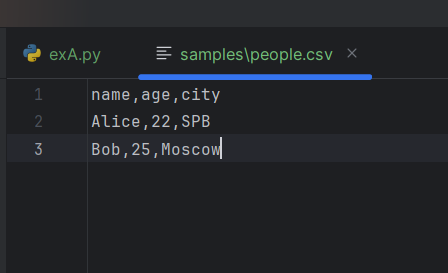
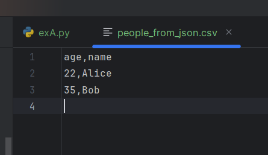
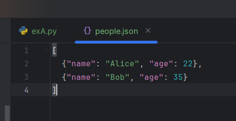
Задание B
```py
import csv
from pathlib import Path
import openpyxl
from openpyxl import Workbook
from openpyxl.utils import get_column_letter

def csv_to_xlsx(csv_path: str, xlsx_path: str) -> None:
    csv_file = Path(csv_path)
    if not csv_file.exists():
        raise FileNotFoundError("Файл не найден")
    if csv_file.suffix != '.csv':
        raise ValueError("Неверный тип файла")

    wb = Workbook()
    ws = wb.active
    ws.title = "Sheet1"

    with open(csv_path, 'r', encoding='utf-8') as f:
        reader = csv.DictReader(f)
        rows = list(reader)
    if len(rows) == 0:
        raise ValueError("Файл не содержит данных")
    if not reader.fieldnames:
        raise ValueError("Файл не содержит заголовка")

    ws.append(reader.fieldnames)

    r_count = 0
    for row in rows:
        r_count += 1
        data_for_ex = []
        for title in reader.fieldnames:
            data_for_ex.append(row[title])
        ws.append(data_for_ex)
    if r_count == 0:
        raise ValueError("Нет данных")

    for col_index in range(1,len(reader.fieldnames)+1):
        column_letter = get_column_letter(col_index)
        max_len = 0
        for row in ws[column_letter]:
            if row.value is not None:
                max_len = max(max_len, len(str(row.value)))

        m_width = max(max_len+2, 8)
        ws.column_dimensions[column_letter].width = m_width

    xlsx_path = Path(xlsx_path)
    wb.save(xlsx_path)


csv_to_xlsx("../data/samples/people.csv", "../data/out/people.xlsx")
csv_to_xlsx("../data/samples/cities.csv", "../data/out/cities.xlsx")
```
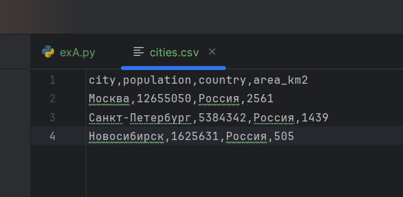
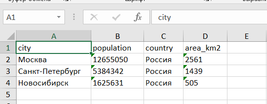
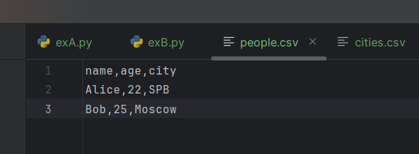
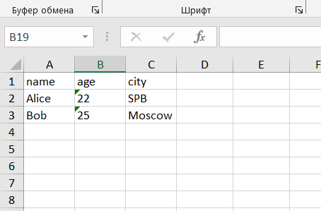

# Лабораторная работа №6
 Задание A
 ```py
 import argparse
from pathlib import Path
from src.lib.text import tokenize, count_freq, top_n


def main():

    parser = argparse.ArgumentParser(description="CLI-утилиты лабораторной №6")

    subparsers = parser.add_subparsers(dest="command", help="Доступные команды")

    stats_parser = subparsers.add_parser("stats", help="Частоты слов в тексте")
    stats_parser.add_argument("--input", required=True, help="Входной текстовый файл")
    stats_parser.add_argument(
        "--top",
        type=int,
        default=5,
        help="Количество топовых слов " "(по умолчанию: 5)",
    )
    cat_parser = subparsers.add_parser("cat", help="Вывод содержимого файла")
    cat_parser.add_argument("--input", required=True, help="Путь к входному файлу")
    cat_parser.add_argument("-n", action="store_true", help="Нумеровать строки")

    args = parser.parse_args()

    file = Path(args.input)

    if not file.exists():
        parser.error("Файл не найден")

    if args.command == "cat":
        with open(file, "r", encoding="utf-8") as f:
            number = 1
            for row in f:
                row = row.rstrip("\n")
                if (args.n):
                    print(f"{number}: {row}")
                    number += 1
                else:
                    print(row)

    elif args.command == "stats":
        with open(file, "r", encoding="utf-8") as f:
            data = [row for row in f]
        data = "".join(data)
        tokens = tokenize(text=data)
        freq = count_freq(tokens=tokens)
        top = top_n(freq=freq, n=args.top)


        number = 1
        for x, y in top:
            print(f"{number}. {x} - {y}")
            number += 1


if __name__ == "__main__":
    main()
```
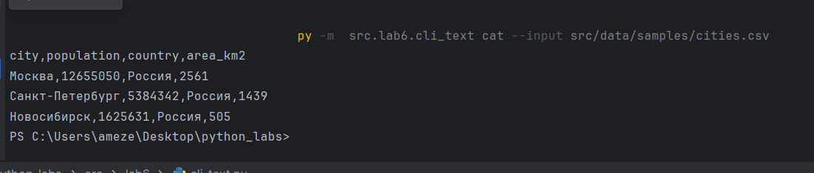
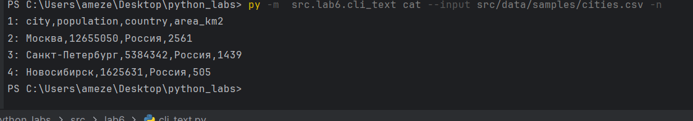
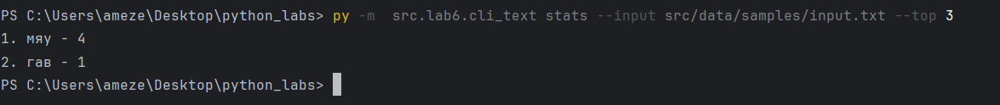
Задание B
```py
import argparse
from pathlib import Path
from src.lab5.exA import json_to_csv, csv_to_json
from src.lab5.exB import csv_to_xlsx


def main():
    parser = argparse.ArgumentParser(description="Конвертер данных между форматами")
    subparsers = parser.add_subparsers(dest="command", help="Доступные команды конвертации")

    # JSON → CSV
    json_to_csv_parser = subparsers.add_parser("json_to_csv", help="Конвертировать JSON в CSV")
    json_to_csv_parser.add_argument("--in", dest="input", required=True, help="Входной JSON файл")
    json_to_csv_parser.add_argument("--out", dest="output", required=True, help="Выходной CSV файл")

    # CSV → JSON
    csv_to_json_parser = subparsers.add_parser("csv_to_json", help="Конвертировать CSV в JSON")
    csv_to_json_parser.add_argument("--in", dest="input", required=True, help="Входной CSV файл")
    csv_to_json_parser.add_argument("--out", dest="output", required=True, help="Выходной JSON файл")
    # CSV → XLSX
    csv_to_xlsx_parser = subparsers.add_parser("csv_to_xlsx", help="Конвертировать CSV в XLSX")
    csv_to_xlsx_parser.add_argument("--in", dest="input", required=True, help="Входной CSV файл")
    csv_to_xlsx_parser.add_argument("--out", dest="output", required=True, help="Выходной XLSX файл")

    args = parser.parse_args()

    if args.command == "json_to_csv":
        json_to_csv(json_path=args.input, csv_path=args.output)

    elif args.command == "csv_to_json":
        csv_to_json(csv_path=args.input, json_path=args.output)

    elif args.command == "csv_to_xlsx":
        csv_to_xlsx(csv_path=args.input, xlsx_path=args.output)


if __name__ == "__main__":
    main()
```
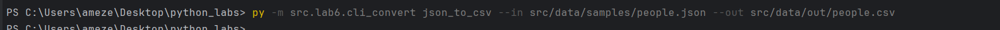
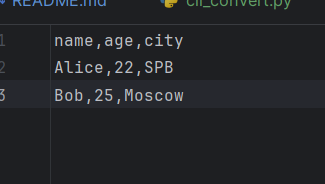
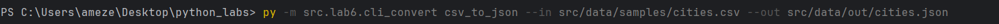
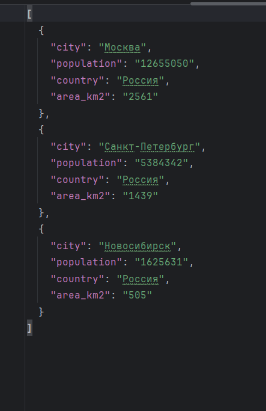
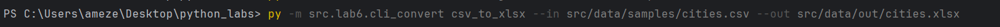
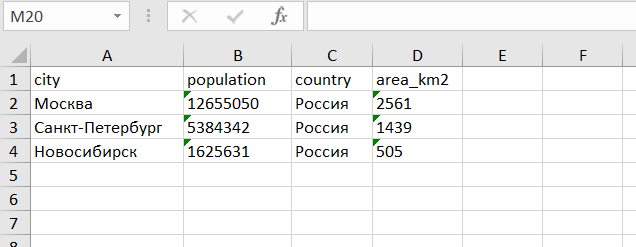

# Лабораторная работа №7
Задание А
```py
import pytest

from src.lib.text import count_freq, normalize, tokenize, top_n


@pytest.mark.parametrize(
    "src,expected",
    [
        ("ПрИвЕт\nМИр\t", "привет мир"),
        ("ёжик, Ёлка", "ежик, елка"),
        ("Hello\r\nWorld", "hello world"),
        ("  двойные   пробелы  ", "двойные пробелы"),
    ],
)
def test_normalize(src, expected):
    assert normalize(src) == expected


@pytest.mark.parametrize(
    "src,expected",
    [
        ("привет мир", ["привет", "мир"]),
        ("hello,world!!!", ["hello", "world"]),
        ("по-настоящему круто", ["по-настоящему", "круто"]),
        ("2025 год", ["2025", "год"]),
        ("emoji 😀 не слово", ["emoji", "не", "слово"]),
    ],
)
def test_tokenize(src, expected):
    assert tokenize(src) == expected


def test_count_and_top():
    tokens = ["a", "b", "a", "c", "b", "a"]
    freq = count_freq(tokens)
    assert freq == {"a": 3, "b": 2, "c": 1}
    assert top_n(freq, 2) == [("a", 3), ("b", 2)]


def test_top_tie_breaker():
    freq = count_freq(["bb", "aa", "bb", "aa", "cc"])
    assert top_n(freq, 2) == [("aa", 2), ("bb", 2)]


def test_dop():
    assert normalize("") == ""
    assert tokenize("") == []
    assert count_freq([]) == {}
    assert top_n({}, 5) == []


def test_top_dop():
    freq = {"a": 3, "b": 2}
    assert top_n(freq, 5) == [("a", 3), ("b", 2)]
```
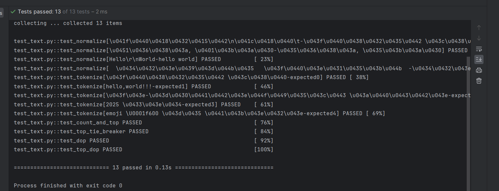
Задание В
```py
import json, csv
from pathlib import Path
import pytest
from src.lib.convert import json_to_csv, csv_to_json


def write_json(path: Path, obj):
    path.write_text(json.dumps(obj, ensure_ascii=False, indent=2), encoding="utf-8")


def read_csv_rows(path: Path):
    with path.open(encoding="utf-8") as f:
        return list(csv.DictReader(f))


def test_json_to_csv_roundtrip(tmp_path: Path):
    src = tmp_path / "people.json"
    dst = tmp_path / "people.csv"
    data = [{"name": "Alice", "age": 22}, {"name": "Bob", "age": 25}]
    write_json(src, data)

    json_to_csv(str(src), str(dst))
    rows = read_csv_rows(dst)
    assert len(rows) == 2
    assert set(rows[0]) >= {"name", "age"}


def test_csv_to_json_roundtrip(tmp_path: Path):
    src = tmp_path / "people.csv"
    dst = tmp_path / "people.json"
    src.write_text("name,age\nAlice,22\nBob,25\n", encoding="utf-8")

    csv_to_json(str(src), str(dst))
    obj = json.loads(dst.read_text(encoding="utf-8"))
    assert isinstance(obj, list) and len(obj) == 2
    assert set(obj[0]) == {"name", "age"}


def test_json_to_csv_empty(tmp_path: Path):
    src = tmp_path / "empty.json"
    dst = tmp_path / "empty.csv"
    src.write_text("[]", encoding="utf-8")

    try:
        json_to_csv(str(src), str(dst))
        if dst.exists():
            pass
    except (ValueError, IndexError):
        pass


def test_csv_to_json_empty(tmp_path: Path):
    src = tmp_path / "empty.csv"
    dst = tmp_path / "empty.json"
    src.write_text("", encoding="utf-8")

    try:
        csv_to_json(str(src), str(dst))
        if dst.exists():
            pass
    except (ValueError, Exception):
        pass


def test_missing_file(tmp_path: Path):
    try:
        csv_to_json("nope.csv", str(tmp_path / "out.json"))
        if (tmp_path / "out.json").exists():
            pass
    except FileNotFoundError:
        pass
```
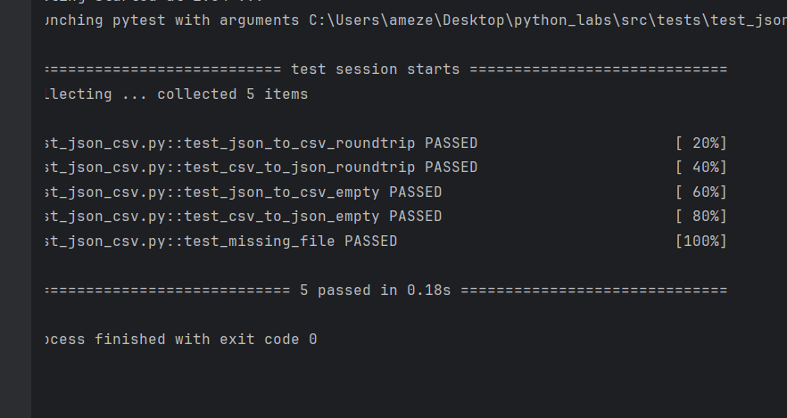

# Лабораторная работа №8

models.py
```py
from dataclasses import dataclass
from datetime import datetime, date
import re


@dataclass
class Student:
    fio: str
    birthdate: str
    group: str
    gpa: float

    def __post_init__(self):
        """Валидация данных после инициализации"""
        # Валидация формата даты
        try:
            datetime.strptime(self.birthdate, "%Y-%m-%d")
        except ValueError:
            raise ValueError("Дата должна быть в формате YYYY-MM-DD")

        # Валидация GPA
        if not (0 <= self.gpa <= 5):
            raise ValueError("GPA должен быть в диапазоне от 0 до 5")

        # Валидация ФИО (должно содержать только буквы и пробелы)
        if not re.match(r'^[A-Za-zА-Яа-яЁё\s]+$', self.fio):
            raise ValueError("ФИО должно содержать только буквы и пробелы")

    def age(self) -> int:
        """Возвращает количество полных лет студента"""
        birth_date = datetime.strptime(self.birthdate, "%Y-%m-%d").date()
        today = date.today()

        age = today.year - birth_date.year

        # Проверяем, был ли уже день рождения в этом году
        if today.month < birth_date.month or (today.month == birth_date.month and today.day < birth_date.day):
            age -= 1

        return age

    def to_dict(self) -> dict:
        """Сериализация объекта в словарь"""
        return {
            "fio": self.fio,
            "birthdate": self.birthdate,
            "group": self.group,
            "gpa": self.gpa
        }

    @classmethod
    def from_dict(cls, data: dict):
        """Десериализация объекта из словаря"""
        return cls(
            fio=data["fio"],
            birthdate=data["birthdate"],
            group=data["group"],
            gpa=data["gpa"]
        )

    def __str__(self) -> str:
        """Строковое представление объекта"""
        return f"{self.fio}, группа {self.group}, возраст {self.age()}, GPA: {self.gpa}"

    def is_excellent(self) -> bool:
        """Дополнительный метод: проверяет, является ли студент отличником"""
        return self.gpa >= 4.5
```
serialize.py
```py
import json
from typing import List
from src.lab8.models import Student


def students_to_json(students: List[Student], path: str) -> None:
    """
    Сохраняет список студентов в JSON файл

    Args:
        students: список объектов Student
        path: путь к файлу для сохранения
    """
    data = [student.to_dict() for student in students]

    with open(path, 'w', encoding='utf-8') as f:
        json.dump(data, f, ensure_ascii=False, indent=2)


def students_from_json(path: str) -> List[Student]:
    """
    Читает JSON файл и создает список объектов Student

    Args:
        path: путь к JSON файлу

    Returns:
        List[Student]: список объектов Student
    """
    try:
        with open(path, 'r', encoding='utf-8') as f:
            data = json.load(f)
        students = []
        for item in data:
            try:
                student = Student.from_dict(item)
                students.append(student)
            except (ValueError, KeyError) as e:
                print(f"Ошибка при создании студента из данных: {item}. Ошибка: {e}")
                continue

        return students

    except FileNotFoundError:
        print(f"Файл {path} не найден")
        return []
    except json.JSONDecodeError:
        print(f"Ошибка декодирования JSON в файле {path}")
        return []
```

tests_ex.py
```py
import sys
import os

# Добавляем путь к src для импорта модулей
sys.path.append(os.path.join(os.path.dirname(__file__), 'src'))

from src.lab8.models import Student
from src.lab8.serialize import students_to_json, students_from_json


def main():
    print("=== Лабораторная работа 8 - Демонстрация ===")
    print()

    # 1. Демонстрация создания объектов
    print("1. Создание объектов Student:")
    print("-" * 40)

    student1 = Student("Иванов Иван Иванович", "2000-05-15", "SE-01", 4.7)
    student2 = Student("Петрова Анна Сергеевна", "2001-08-22", "SE-02", 3.8)
    student3 = Student("Сидоров Алексей Петрович", "1999-12-10", "SE-01", 4.2)

    print("Созданные студенты:")
    print(f"  • {student1}")
    print(f"  • {student2}")
    print(f"  • {student3}")
    print()

    # 2. Демонстрация методов
    print("2. Демонстрация методов:")
    print("-" * 40)

    print(f"Студент {student1.fio.split()[1]} является отличником: {student1.is_excellent()}")
    print(f"Студент {student2.fio.split()[1]} является отличником: {student2.is_excellent()}")
    print()

    # 3. Сериализация в JSON
    print("3. Сериализация в JSON:")
    print("-" * 40)

    students_list = [student1, student2, student3]
    output_path = "../data/lab8/students_output.json"

    # file = open("../lab4/input.txt", 'w', encoding='utf-8')

    students_to_json(students_list, output_path)
    print(f" Список студентов сохранен в: {output_path}")
    print()

    # 4. Десериализация из JSON
    print("4. Десериализация из JSON:")
    print("-" * 40)

    input_path = "../data/lab8/students_input.json"
    loaded_students = students_from_json(input_path)

    print(f" Загружено студентов из {input_path}: {len(loaded_students)}")
    for i, student in enumerate(loaded_students, 1):
        print(f"  {i}. {student}")
    print()

    # 5. Демонстрация обработки ошибок
    print("5. Демонстрация обработки ошибок:")
    print("-" * 40)

    print("Попытка создания студента с неправильным GPA (6.0):")
    try:
        bad_student1 = Student("Тестовый Студент", "2000-01-01", "SE-01", 6.0)
    except ValueError as e:
        print(f"   Ошибка: {e}")

    print("Попытка создания студента с неправильным форматом даты:")
    try:
        bad_student2 = Student("Тестовый Студент", "2000/01/01", "SE-01", 4.0)
    except ValueError as e:
        print(f"   Ошибка: {e}")

    print("Попытка создания студента с неправильным ФИО:")
    try:
        bad_student3 = Student("Студент123", "2000-01-01", "SE-01", 4.0)
    except ValueError as e:
        print(f"   Ошибка: {e}")

    print()
    print("=== Демонстрация завершена ===")


if __name__ == "__main__":
    main()
```
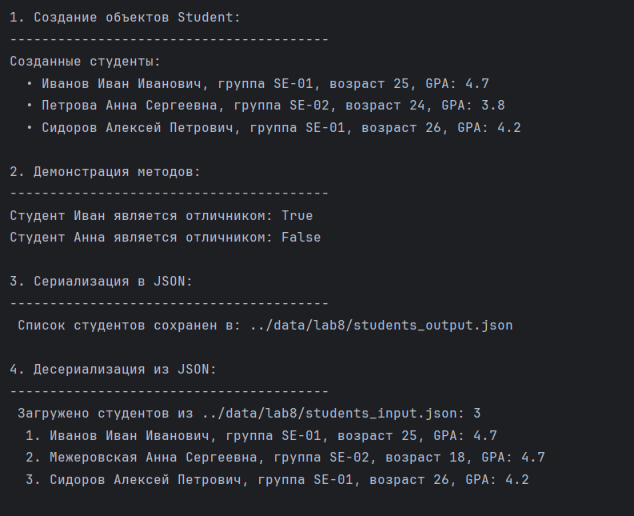
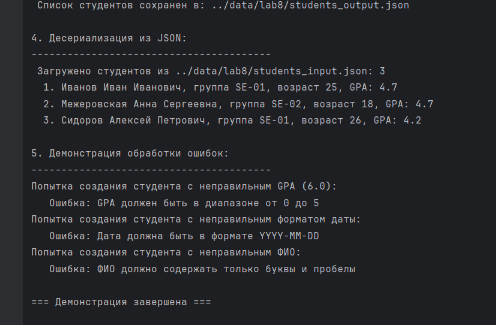
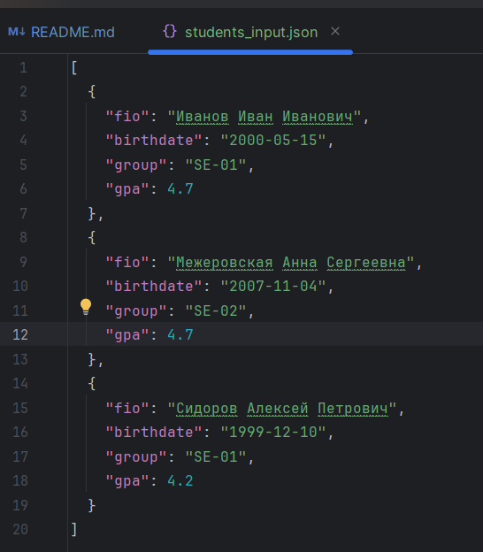
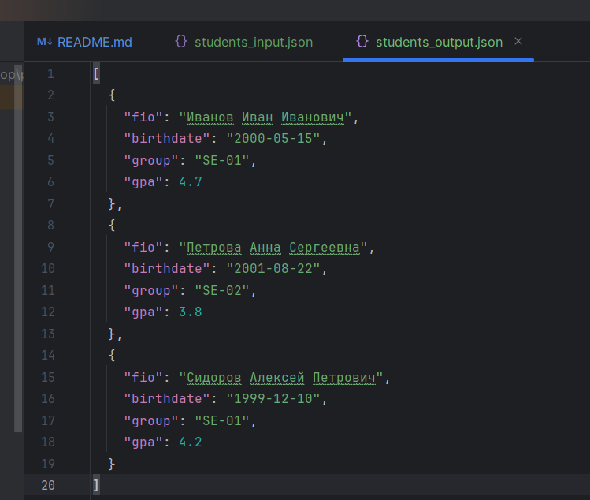
